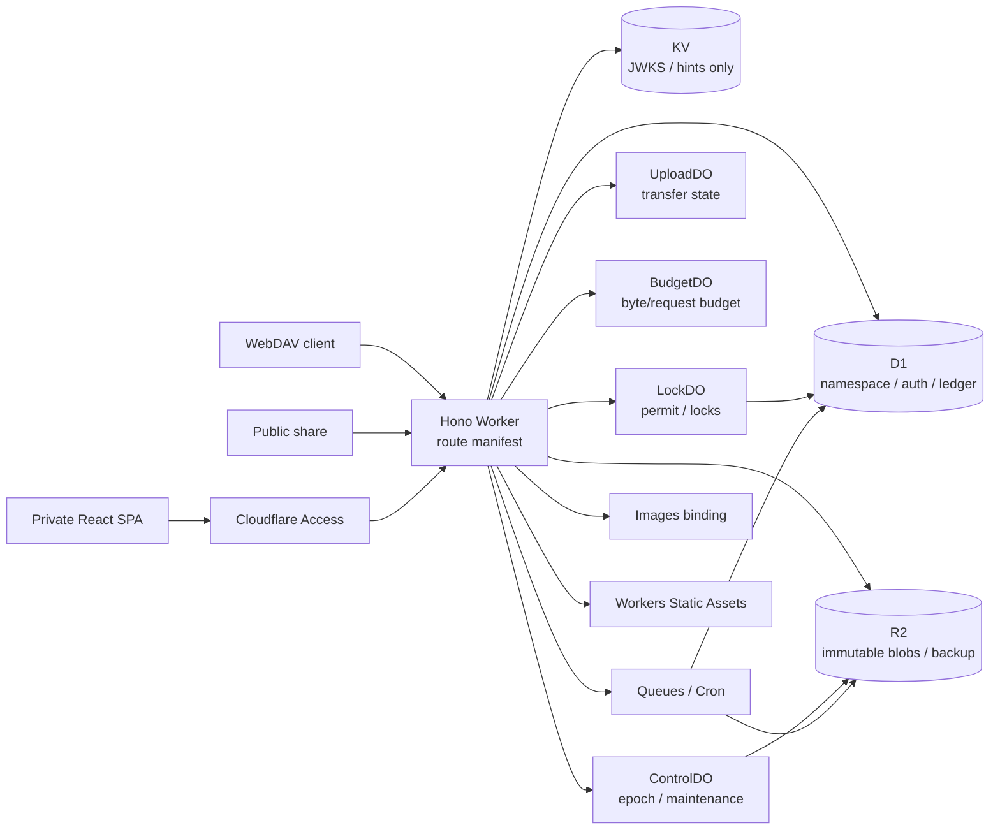

# Next-cloud-flare

Cloudflare Workers、D1、R2、Durable Objects、Queues、KV、Images、Access だけで構成するセルフホスト型ストレージ管理アプリです。Google Drive / Nextcloud に近い namespace と UI を提供しつつ、content は不変 R2 object、認可・台帳・operation は D1、復旧 epoch は ControlDO を正本にします。

現在の実装到達点は **Phase 1（Foundation）** です。schema、認証 session contract、quota/ref ledger、permit、epoch、outbox、最小 folder create は実装済みですが、HTTP auth adapter と Files content 以降は fail closed です。現時点を production 対応版として配備しないでください。詳細は `docs/STATUS.md` を参照してください。

## アーキテクチャ



### 正本

| データ | 正本 |
|---|---|
| namespace、認可、operation、quota、ref、outbox | D1 primary |
| original content、derivative、backup generation | private R2 |
| epoch、maintenance、GC pause | ControlDO + R2 epoch history |
| lock/permit の直列化 | LockDO。commit fence は D1 permit row |
| upload part/in-flight | UploadDO + D1/R2 durable state |
| content byte/request budget | BudgetDO durable storage + D1 session |

## 必要環境

- Node.js 20.x
- pnpm 9.x（repository は `pnpm@9.15.9` を固定）
- Cloudflare Workers Paid account
- custom domain を管理できる Cloudflare zone
- Cloudflare Access、D1、R2、KV、Queues、Images、Rate Limiting

依存 package は exact version で固定され、lockfile に記録されています。

## ローカルセットアップ

```bash
corepack enable
corepack prepare pnpm@9.15.9 --activate
pnpm install --frozen-lockfile
cp .dev.vars.example .dev.vars
pnpm build
pnpm dev
```

`.dev.vars` には実際の secret を入れます。`.dev.vars` は追跡対象外です。secret、JWT、Basic credential、share token を source、test fixture、URL、log に保存しないでください。

Phase 1 の HTTP route は認証 adapter 未実装のため 503 で fail closed します。ローカル integration test は Miniflare の実 D1/R2/DO binding を使用します。

## Cloudflare resource の作成

以下は名前の例です。staging と production で resource、Access AUD、key ring を共有しないでください。

```bash
pnpm exec wrangler d1 create ncf-staging
pnpm exec wrangler d1 create ncf-production
pnpm exec wrangler r2 bucket create ncf-staging-blobs
pnpm exec wrangler r2 bucket create ncf-staging-backups
pnpm exec wrangler r2 bucket create ncf-production-blobs
pnpm exec wrangler r2 bucket create ncf-production-backups
pnpm exec wrangler kv namespace create ncf-staging-cache
pnpm exec wrangler kv namespace create ncf-production-cache
pnpm exec wrangler queues create ncf-staging-jobs
pnpm exec wrangler queues create ncf-staging-jobs-dlq
pnpm exec wrangler queues create ncf-production-jobs
pnpm exec wrangler queues create ncf-production-jobs-dlq
pnpm exec wrangler queues update ncf-staging-jobs --message-retention-period-secs 1209600
pnpm exec wrangler queues update ncf-production-jobs --message-retention-period-secs 1209600
```

1. `wrangler.jsonc` の `<D1_ID>`、`<KV_ID>` と Access placeholder を対象 environment の値へ置換します。
2. blobs bucket は public access と `r2.dev` を無効にします。
3. incomplete multipart upload を 7 日で abort する lifecycle rule を environment ごとに設定します。
4. Queue retention は 14 日、DLQ と consumer concurrency は設計値に固定します。
5. Images binding、Rate Limiting binding、custom domain、Cron が resource inventory と一致することを確認します。
6. `workers.dev` と preview URL は有効化しません。

現在の `wrangler.jsonc` は development placeholder です。staging/production の実 ID を repository に直接 commit せず、承認済み inventory/IaC から environment block を生成してください。

## Cloudflare Access

最低限、次の Access application/policy を分離します。

1. **Private app**: app host の `/`、`/assets/*`、private `/api/v1/*` を user Access policy で保護します。Google IdP + MFA と owner allowlist を設定します。
2. **Service automation**: `/api/v1/automation/*` の完全 path だけを Service Auth policy に割り当てます。v1 は read-only です。
3. **Public/share bypass**: `/s`、`/s/*`、`/public-assets/*`、`/api/v1/public/*` だけを Bypass にします。private SPA/API への fallthrough を許可しません。
4. **WebDAV bypass**: `/dav` と `/dav/*` を Bypass にし、Worker の HTTPS Basic app-password 認証だけを使います。
5. **Content host bypass**: content host の `/session`、`/c/*`、`/reader/*` を Bypass にし、content-session Cookie と purpose-bound ticket で認証します。

未知 host、alias、method-template は 404 にし、Bypass request に Access JWT が付いていても user/service principal へ昇格させません。

## Secret の登録

値は対話入力または CI secret store から渡し、command history に直接書かないでください。

```bash
pnpm exec wrangler secret put SIGNING_KEYS --env staging
pnpm exec wrangler secret put CSRF_KEY --env staging
pnpm exec wrangler secret put CONTENT_SESSION_KEY --env staging
pnpm exec wrangler secret put APP_PASSWORD_PEPPER --env staging
pnpm exec wrangler secret put SIGNING_KEYS --env production
pnpm exec wrangler secret put CSRF_KEY --env production
pnpm exec wrangler secret put CONTENT_SESSION_KEY --env production
pnpm exec wrangler secret put APP_PASSWORD_PEPPER --env production
```

ControlDO storage loss時に R2 epoch history から下限を証明できない場合だけ、operator が `EPOCH_FLOOR` を設定します。時刻を epoch floor に使用しません。

## 開発コマンド

| command | 内容 |
|---|---|
| `pnpm dev` | Worker と Vite dev server |
| `pnpm lint` | ESLint flat config + Prettier check |
| `pnpm typecheck` | workspace strict TypeScript |
| `pnpm test` | unit + Workers integration |
| `pnpm test:unit` | pure TypeScript contract/state test |
| `pnpm test:integration` | Miniflare D1/R2/DO integration |
| `pnpm test:e2e` | browser E2E entry point。Phase 7 までは test 未実装 |
| `pnpm build` | shared、React SPA、Worker dry-run bundle |
| `pnpm verify:contracts` | manifest/contract tests |
| `pnpm verify:config` | Wrangler dry-run config validation |

## テスト範囲

Phase 0/1 では次を自動検証します。

- D1 `_assert` SQL error の全 batch rollback と `changes()` の直前 statement 性
- G01 三反例、permit expiry/revoke、credential revoke、old epoch
- complete FK graph、purge order、独立 trash 子、deleting blob 復旧拒否
- Access session identity/logout、CSRF、operation credential 照合
- ControlDO R2 epoch floor、BudgetDO eviction/unknown transfer、LockDO permit
- quota/ref ledger、outbox duplicate/ack loss、EffectiveLive depth 64
- R2 known-length stream、Range、DigestStream、STORE ZIP exact size、backpressure/cancel
- DAV Timeout/PUT precondition/ETag contract と upload state contract
- route manifest 外の Hono route が存在しないこと

Miniflare 合格は Cloudflare staging 合格を意味しません。実 D1 の `rows_read` / `duration_ms`、Access policy、Cookie、R2 lifecycle/response loss、DO placement/eviction、Queues、Images、実 WebDAV/browser は staging/release gate が必要です。

## migration

未承認の production migration は実行しないでください。staging では maintenance/backup point を確認してから実行します。

```bash
pnpm exec wrangler d1 migrations list ncf-staging --remote
pnpm exec wrangler d1 migrations apply ncf-staging --remote
```

Foundation migration の rollback は destructive down SQL ではなく D1 Time Travel または検証済み snapshot restore です。restore 中は maintenance、permit revoke、job/GC quiesce、ControlDO epoch bump、quota/ref/FTS 再検証が必要です。

## build と deploy

```bash
pnpm install --frozen-lockfile
pnpm lint
pnpm typecheck
pnpm test
pnpm build
pnpm verify:config
```

Phase 1 checkpoint は production deploy 対象ではありません。後続 phase と staging gate が完了した後の承認付き手順は次の順です。

1. environment resource inventory と placeholder 置換結果を検証する。
2. D1 backup point を作成し、staging migration を適用する。
3. `pnpm exec wrangler deploy --env staging` を実行する。
4. Access/Bypass、host、HTTPS、content CORS/Cookie、unknown route、D1/R2/DO/Queue/Images smoke を実行する。
5. restore/rollback rehearsal と support matrix を承認する。
6. 同じ artifact/config digest を two-person approval 後に production へ配備する。

PR CI から production へ自動 deploy しません。

## v1 サポートマトリクス

| 機能 | 現在 | v1 目標 |
|---|---|---|
| exact toolchain / Worker bundle | 合格 | 対応 |
| D1 schema / FK / atomic barrier | Miniflare 合格 | 対応 |
| ControlDO epoch / LockDO permit / BudgetDO counter | Foundation 合格 | 対応 |
| folder create | service-level integration のみ | REST/UI 対応 |
| Cloudflare Access / app password HTTP auth | fail closed | 対応 |
| file upload/download/version/COPY/MOVE | 未実装 | 対応 |
| trash/restore/purge/GC/backup drill | contract/schema のみ | 対応 |
| list/search/stats/share/ZIP | 未実装 | 対応 |
| WebDAV Class 1/2 | protocol contract のみ | 対応 |
| Gallery | 未実装 | 基本 UI 対応 |
| EPUB/CBZ/PDF Bookshelf | 未実装 | scroll/TOC/CFI 対応 |
| Audio | 未実装 | 基本 player/position 対応 |
| PWA、RAR/7z、DRM/fixed-layout EPUB、Office 同時編集 | 非対応 | v1 非対応 |

未合格機能を support 済みとして公開しません。
